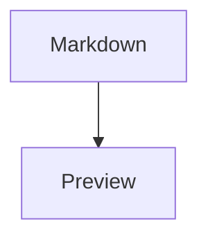

# Diagram Preview Tool

Minimal VS Code extension MVP for opening a Mermaid fenced block from a Markdown file and keeping a large live preview beside the editor while Markdown remains the only source of truth.

## What it does

- opens a Mermaid block under the cursor from a Markdown editor
- opens the nearest Mermaid block when the cursor is on the fence line, on the word `mermaid`, inside the block, or just a few lines away
- shows a preview-first webview with the diagram taking most of the space by default
- keeps the in-panel Mermaid source available as an optional, collapsible editor
- keeps the Markdown file as the only source of truth
- applies edits back into the original fenced block and saves the file
- refreshes preview state when the Markdown file changes

## Commands

- `Open Mermaid Preview`
- `Open Mermaid Block Under Cursor`
- `Refresh Mermaid Preview`
- `Apply Mermaid Edits To Markdown`

The editor context menu also includes `Open Mermaid Block Under Cursor` when a Markdown editor is active.

## Install and run locally

1. Install dependencies:

```bash
npm install
```

2. Build the extension:

```bash
npm run build
```

3. Open this folder in VS Code.
4. Press `F5` to launch an Extension Development Host.
5. In the development host, open a Markdown file containing a fenced Mermaid block like:

```md

```

6. Place the cursor inside the Mermaid block.
7. Run `Open Mermaid Block Under Cursor` from the command palette or right-click menu.
8. Keep editing the Markdown file in VS Code and watch the preview update live.
9. If you want quick in-panel editing, click `Show Source`, edit there, and use `Apply to Markdown`.

## Notes

- V1 works with one Mermaid block per preview panel.
- The preview uses Mermaid from a CDN inside the webview.
- If the Markdown block is edited in the source editor, the preview updates to match the file.
- The preview opens with the source editor hidden so the diagram can dominate the panel.
