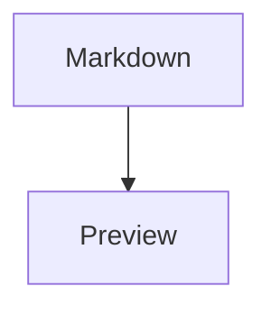

# Diagram Preview Tool

Minimal VS Code extension MVP for opening a Mermaid fenced block from a Markdown file, editing the Mermaid source beside the editor, previewing it live, and writing changes back into the original Markdown block.

## What it does

- opens a Mermaid block under the cursor from a Markdown editor
- shows Mermaid source and rendered preview side by side in a VS Code webview
- keeps the Markdown file as the only source of truth
- applies edits back into the original fenced block and saves the file
- refreshes preview state when the Markdown file changes

## Commands

- `Open Mermaid Preview`
- `Open Mermaid Block Under Cursor`
- `Refresh Mermaid Preview`
- `Apply Mermaid Edits To Markdown`

The editor context menu also includes `Open Mermaid Block Under Cursor` when a Markdown editor is active.

## Install and run locally

1. Install dependencies:

```bash
npm install
```

2. Build the extension:

```bash
npm run build
```

3. Open this folder in VS Code.
4. Press `F5` to launch an Extension Development Host.
5. In the development host, open a Markdown file containing a fenced Mermaid block like:

```md

```

6. Place the cursor inside the Mermaid block.
7. Run `Open Mermaid Block Under Cursor` from the command palette or right-click menu.
8. Edit the Mermaid source in the left pane and use `Apply to Markdown` to write changes back to the original file.

## Notes

- V1 works with one Mermaid block per preview panel.
- The preview uses Mermaid from a CDN inside the webview.
- If the Markdown block is edited in the source editor, the preview updates to match the file.
