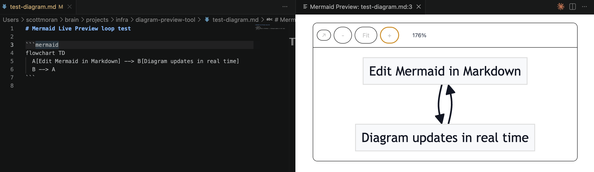

# Mermaid Live Preview — quick verification flow

Use this when you want to verify the extension behavior by clicking, not by running terminal commands.

## 1) Install extension

1. Open Extensions in VS Code (`Cmd/Ctrl+Shift+X`).
2. Search for **Mermaid Live Preview AI** and install it from Marketplace.

## 2) Test file (shared)

Open this Markdown file for verification:
- [test-diagram.md](test-diagram.md)

## 3) Verify behavior

1. Open `test-diagram.md` in a Markdown editor.
2. Run `Open Mermaid Preview` from command palette or right-click near the fence.
3. Confirm:
   - Preview opens in a wide panel beside the editor.
   - Markdown edits update preview immediately.
   - The tiny reveal arrow/“↗” returns you to the Mermaid block in source.

## 4) If you just published a new version

1. Go to Extensions in VS Code and search `Mermaid Live Preview AI`.
2. Confirm the installed version is `0.1.5` (or your latest tag).
3. Open `test-diagram.md` and run the flow above.

If the marketplace page says `Verifying` after upload:
- It usually settles in a few minutes.
- The extension can still become available after verification completes.
- If status is still not done after ~10 minutes, return to the extension publish page and check the exact error text; I can patch any metadata issue immediately.

If behavior still looks wrong after this flow, use this doc again and I’ll patch the next iteration directly.
