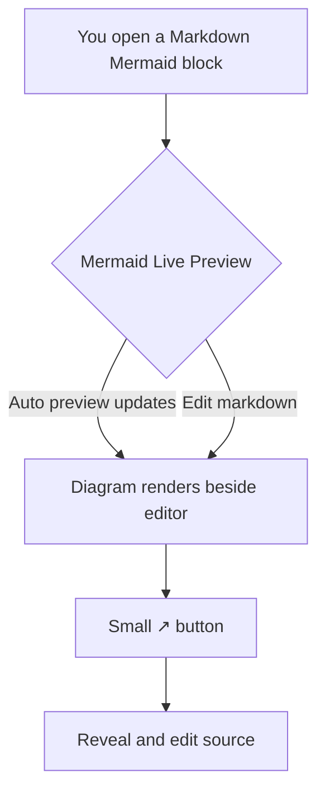

# Mermaid Live Preview — Sanity Check

Use this file to validate the extension visually.

## Mermaid test

```mermaid
flowchart TD
  A[You open a Markdown Mermaid block] --> B{Mermaid Live Preview}
  B -->|Auto preview updates| C[Diagram renders beside editor]
  C --> D[Small ↗ button]
  D --> E[Reveal and edit source]
  B -->|Edit markdown| C
```

If the preview does not render, tell me what you see and I will adjust immediately.
